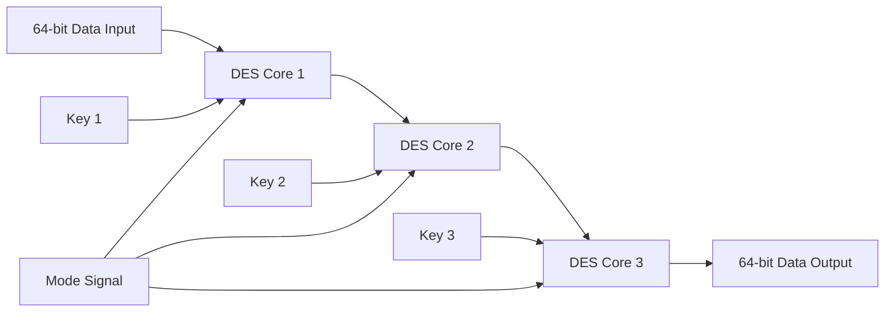

# 3DES 168-bit Hardware Implementation


## Introduction

This repository contains a Verilog HDL implementation of the **Triple Data Encryption Standard (3DES)** using a **168-bit key**.

The project implements DES and Triple DES hardware architectures for encryption and decryption. The design is verified using Verilog testbenches and can be simulated using tools such as ModelSim, Vivado, or other Verilog simulators.

## Triple DES Overview

Triple DES applies the DES algorithm three times using three independent keys:

### Encryption

```text
C = E(K3, D(K2, E(K1, P)))
```

### Decryption

```text
P = D(K1, E(K2, D(K3, C)))
```

Where:

| Symbol | Description |
|---|---|
| `P` | 64-bit plaintext |
| `C` | 64-bit ciphertext |
| `K1` | First 56-bit DES key |
| `K2` | Second 56-bit DES key |
| `K3` | Third 56-bit DES key |

The total key length is:

```text
56 bits × 3 = 168 bits
```

## Project Objectives

The main objectives of this project are:

- Implement DES and 3DES using Verilog HDL
- Support both encryption and decryption modes
- Build different hardware architectures for comparison
- Verify functionality using simulation testbenches
- Evaluate latency, throughput, and hardware behavior

## Repository Structure

```text
3DES_168bit_Hardware/
├── DES_core.v
├── DES_core_base.v
├── DES_core_DeepPipe.v
├── Tri_DES.v
├── Tri_DES_base.v
├── Tri_DES_DeepPipe.v
├── tb_DES_core.v
├── tb_DES_core_base.v
├── tb_DES_core_DeepPipe.v
├── tb_Tri_DES.v
├── tb_Tri_DES_base.v
└── tb_Tri_DES_DeepPipe.v
```

## File Description

| File | Description |
|---|---|
| `DES_core.v` | DES core implementation |
| `DES_core_base.v` | Base DES architecture |
| `DES_core_DeepPipe.v` | Deep pipeline DES architecture |
| `Tri_DES.v` | Triple DES top-level implementation |
| `Tri_DES_base.v` | Base Triple DES architecture |
| `Tri_DES_DeepPipe.v` | Deep pipeline Triple DES architecture |
| `tb_DES_core.v` | Testbench for DES core |
| `tb_DES_core_base.v` | Testbench for base DES core |
| `tb_DES_core_DeepPipe.v` | Testbench for DeepPipe DES core |
| `tb_Tri_DES.v` | Testbench for Triple DES |
| `tb_Tri_DES_base.v` | Testbench for base Triple DES |
| `tb_Tri_DES_DeepPipe.v` | Testbench for DeepPipe Triple DES |

## Implemented Architectures

### 1. Base Architecture

The base architecture processes DES rounds sequentially using control logic.

Characteristics:

- Simple hardware structure
- Area-efficient implementation
- Uses multiple clock cycles to complete one encryption or decryption operation
- Suitable for designs where area is more important than throughput

### 2. DeepPipe Architecture

The DeepPipe architecture is designed to improve throughput by adding pipeline registers into the DES datapath.

Main idea:

- DeepPipe inherits the round-splitting idea from the multi-cycle architecture
- Instead of controlling each phase using FSM states, pipeline registers are inserted between processing stages
- The 16 Feistel rounds are unrolled into pipeline stages
- `valid_in` and `valid_out` are used to indicate valid data flow through the pipeline

The DES round can be divided into three main processing stages:

```text
Expansion + XOR  →  S/P-box processing  →  L/R update
```

After the pipeline is filled, the architecture can produce output continuously with improved throughput.

## 3DES Architecture

In 3DES, three DES cores are connected in cascade.

For encryption:

```text
Plaintext → DES Encrypt K1 → DES Decrypt K2 → DES Encrypt K3 → Ciphertext
```

For decryption:

```text
Ciphertext → DES Decrypt K3 → DES Encrypt K2 → DES Decrypt K1 → Plaintext
```

## Architecture Diagram



## DeepPipe Data Flow

```mermaid
flowchart LR
    IN[Input Data] --> IP[Initial Permutation]
    IP --> REG0[Pipeline Register]

    REG0 --> R1[Feistel Round 1]
    R1 --> REG1[Pipeline Register]

    REG1 --> R2[Feistel Round 2]
    R2 --> REG2[Pipeline Register]

    REG2 --> DOTS[...]
    DOTS --> R16[Feistel Round 16]

    R16 --> REG16[Pipeline Register]
    REG16 --> FP[Final Permutation]
    FP --> OUT[Output Data]
```



## Top-Level Interface Example

An example interface for the DeepPipe Triple DES module is shown below:

```verilog
module Tri_DES_DeepPipe (
    input clk,
    input rst,
    input valid_in,
    input mode,
    input [63:0] data_in,
    input [55:0] key1,
    input [55:0] key2,
    input [55:0] key3,
    output valid_out,
    output [63:0] data_out
);
```

## Signal Description

| Signal | Direction | Width | Description |
|---|---:|---:|---|
| `clk` | Input | 1 | System clock |
| `rst` | Input | 1 | Reset signal |
| `valid_in` | Input | 1 | Indicates that input data is valid |
| `mode` | Input | 1 | Selects encryption or decryption mode |
| `data_in` | Input | 64 | Plaintext or ciphertext input |
| `key1` | Input | 56 | First DES key |
| `key2` | Input | 56 | Second DES key |
| `key3` | Input | 56 | Third DES key |
| `valid_out` | Output | 1 | Indicates that output data is valid |
| `data_out` | Output | 64 | Ciphertext or plaintext output |

> Note: The exact port list may be different depending on the selected module. Please check the corresponding Verilog source file before simulation or synthesis.

## Operation Mode

The design supports both encryption and decryption.

| Mode | Operation |
|---|---|
| Encryption | Plaintext to ciphertext |
| Decryption | Ciphertext to plaintext |

In encryption mode, the data passes through:

```text
DES Encrypt → DES Decrypt → DES Encrypt
```

In decryption mode, the data passes through:

```text
DES Decrypt → DES Encrypt → DES Decrypt
```

## Simulation

The design is verified using Verilog testbenches included in this repository.

Simulation flow:

1. Apply reset
2. Provide input data and keys
3. Select encryption or decryption mode
4. Start the operation or assert `valid_in`
5. Wait for `done` or `valid_out`
6. Compare the output with the expected result

## Testbenches

| Testbench | Purpose |
|---|---|
| `tb_DES_core.v` | Verifies the main DES core |
| `tb_DES_core_base.v` | Verifies the base DES architecture |
| `tb_DES_core_DeepPipe.v` | Verifies the DeepPipe DES architecture |
| `tb_Tri_DES.v` | Verifies the main Triple DES design |
| `tb_Tri_DES_base.v` | Verifies the base Triple DES architecture |
| `tb_Tri_DES_DeepPipe.v` | Verifies the DeepPipe Triple DES architecture |

## How to Run Simulation

### 1. Clone the repository

```bash
git clone https://github.com/NhatHuyUIT/3DES_168bit_Hardware.git
cd 3DES_168bit_Hardware
```

### 2. Compile Verilog files

Example using ModelSim:

```tcl
vlog *.v
```

### 3. Run a testbench

For the DeepPipe Triple DES testbench:

```tcl
vsim tb_Tri_DES_DeepPipe
run -all
```

For the base Triple DES testbench:

```tcl
vsim tb_Tri_DES_base
run -all
```

## Example Test Vector

```text
Plaintext  : 0123456789ABCDEF
Key 1      : 133457799BBCDFF1
Key 2      : 1122334455667788
Key 3      : AABB09182736CCDD
Ciphertext : <verified simulation result>
```

> The expected ciphertext should be updated according to the verified result from the simulation waveform or console output.

## Performance Comparison

| Architecture | Latency | Throughput | Advantage |
|---|---:|---:|---|
| Base | Multiple clock cycles | Low | Simple and area-efficient |
| DeepPipe | Pipeline latency | High after pipeline fill | High throughput |

## Design Notes

- DES processes 64-bit data blocks
- Each DES operation uses a 56-bit key
- 3DES uses three DES keys, resulting in a 168-bit key length
- The base architecture is suitable for area-oriented design
- The DeepPipe architecture is suitable for throughput-oriented design
- Pipeline registers increase hardware usage but improve data processing rate

## Tools Used

- Verilog HDL
- ModelSim
- Vivado
- Quartus
- GitHub

## Possible Improvements

Future improvements may include:

- Add synthesis reports
- Add timing reports
- Add resource utilization comparison
- Add more official test vectors
- Add waveform screenshots
- Add FPGA implementation results
- Add block diagrams for each architecture

## Author

**Nguyễn Nhật Huy - 23520636**  
Computer Engineering Student  
University of Information Technology - VNUHCM

## License

This project is developed for academic and educational purposes.